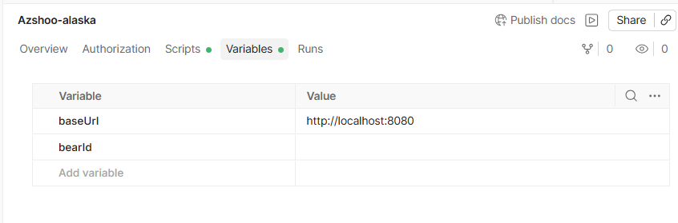
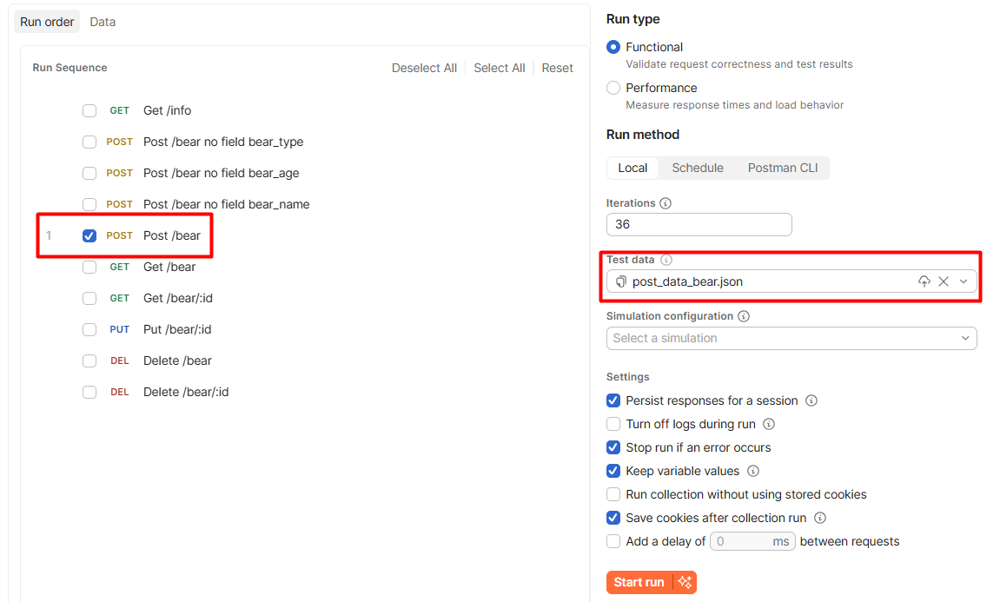
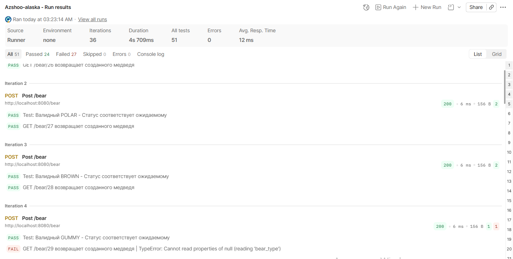

# :notebook: Postman

Проверка работы запросов на примере запроса `POST /bear - добавить медведя`

1. Структура коллекции

```
Azshoo-alaska
├── 📁 Info
│   └── GET /info
├── 📁 POST /bear
│   ├── 📁 Позитивные
│   │   └── Добавить медведя (параметризованный)
│   └── 📁 Негативные
│       ├── Отсутствует bear_type
│       ├── Отсутствует bear_name
│       └── Отсутствует bear_age
├── 📁 GET /bear
│   ├── GET все медведи
│   └── GET по ID
├── 📁 PUT /bear/:id
│   └── Обновление медведя
├── 📁 DELETE /bear
│   ├── Удалить всех
│   └── Удалить по ID
└── 📁 Очистка (если нужно)
    └── DELETE /bear (очистка после всех тестов)

```

2. Переменные коллекции



3. Настройка запросов с переменными

### POST /bear - добавить медведя (параметризованный)

3.1. Для удобства названия запросов логируются в консоли Postman. Для этого в PreRequest необходимо добавить следующий скрипт

```
var testName = pm.iterationData.get("testName");
console.log("▶️ Выполняется тест: " + testName);
```

3.2. Добавить в PreRequest скрипт для динамической генерации длинной строки

```
if (pm.iterationData.get("longName") === true) {
pm.variables.set("bear_name", "A".repeat(2501));
} else {
pm.variables.set("bear_name", pm.iterationData.get("bear_name"));
}
```

3.3. Добавить скрипт проверки в PostResponse

```
var testName = pm.iterationData.get("testName");

// 1. Проверка статуса
pm.test("Test: " + testName + " - Статус соответствует ожидаемому", function () {
    pm.response.to.have.status(Number(pm.iterationData.get("expectedStatus")));
});


// 2. Если ожидается успешный ответ (200) - Проверка через GET
if (pm.iterationData.get("expectedStatus") == "200") {

    // Сохраняем ID для последующих тестов
    var responseText = pm.response.text().trim();
    var bearId = parseInt(responseText);
    if (!isNaN(bearId)) {
        pm.collectionVariables.set("bearId", bearId);
    }

    // Проверка через GET (проверить сохранение)
    pm.sendRequest({
        url: pm.variables.get("baseUrl") + "/bear/" + bearId,
        method: 'GET'
    }, function (err, res) {
        pm.test("GET /bear/" + bearId + " возвращает созданного медведя", function () {
            pm.expect(res.code).to.eql(200);
            if (res.code === 200) {
                var jsonData = res.json();
                pm.expect(jsonData.bear_type).to.eql(pm.iterationData.get("expectedType"));
                pm.expect(jsonData.bear_name).to.eql(pm.iterationData.get("expectedName"));
                pm.expect(jsonData.bear_age).to.eql(Number(pm.iterationData.get("expectedAge")));
            }
        });
    });
}
```

3.4. Body запроса raw json:

```
{
    "bear_type": "{{bear_type}}",
    "bear_name": "{{bear_name}}",
    "bear_age": {{bear_age}}
}
```

4. Далее, выбираем, запрос который хотим прогнать и добавляем заранее подготовленные тестовые данные (post_data_bear.json)



5. Запускаем коллекцию и видим, что все запросы успешно улетели. При нажатии на сам запрос можем посмотреть данные, которые мы отправляли и убедиться, что ушло именно то, что хотели.


