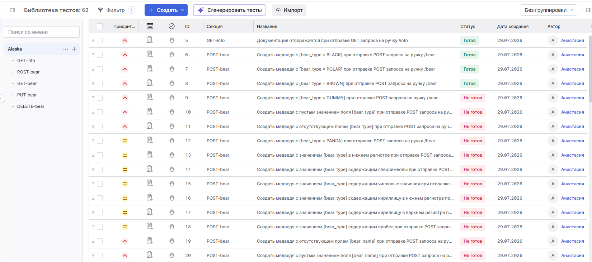
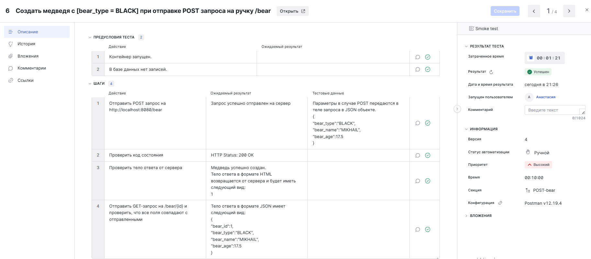

# :notebook: Примеры Тест-кейсов

## 📚 Содержание
- [Excel/Google Sheets](#title1)
- [TMS/Test IT](#title2)

## 1. <a id="title1">`Excel/Google Sheets`.</a>

> Полный список **_Тест-кейсов_** можно посмотреть на [Google Таблицы (Google Sheets)](https://docs.google.com/spreadsheets/d/10hUvu6_IJgQVKPAjx7r2q_4k0RxREr7E/edit?usp=sharing&ouid=105693084772138040478&rtpof=true&sd=true)

---

### `POST /bear` - создать медведя c `[bear_type:BLACK]`

### `GET /bear` - получить заполненный список медведей

### `PUT /bear/:id` - обновить `[bear_type]` на допустимые значения (POLAR)

### `DELETE /bear/:id` - удалить существующего медведя по ID

## 2. <a id="title2">`TMS/Test IT`.</a>
> Пример списка **_Тест-кейсов_** в Test IT

### `POST /bear` - создать медведя c `[bear_type:BLACK]`

